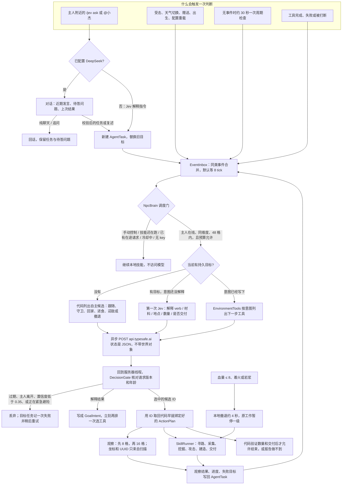

# NPC 决策架构

> 本文记录旧版设计。当前 `codex/jev-led-harness` 分工、调用边界及验收见 [Jev 主导 Harness](deepseek-harness-proposal.md) 与 [客户端验收](client-validation.md)。旧版 DeepSeek 直达任务、本地语义回退和关键词授权已被替换。

更新：2026-09-25。这是当前代码的结构说明，方案边界见 [design.md](design.md)，交付状态见 [development-progress.md](development-progress.md)。寻路器、恢复规则、向主人提问、自主需求和 DeepSeek 对话的分层设计见 [layered-agent.md](layered-agent.md)；下图的「SkillRunner」现在把所有移动交给 `navigation/Navigator`，「无事件时的周期检查」之外还有空闲时的自主评估。

**模型只做有限选择，游戏代码拥有世界和执行。** 一次判断可以驱动几十到几百个 tick 的寻路、采集或战斗。危险不等云端，由本地技能立刻处理。

## 两条决策路径

主人说话时，配置了 DeepSeek 就先对话，纯聊天不会建任务；确定要做事才建一个 `AgentTask`，优先保留结合上下文的任务复述。未配置 DeepSeek 时直接进入 Jev 指令流程。任务保存请求、类型化意图、轮数、采集进度、本任务入包账本和最近 12 条工具结果。之后按需走两段模型调用；DeepSeek 给出合法意图时跳过第一段。

1. **解释意图。** `task.intent` 还是空时，`JevClient` 一次问完六个问题：动作（`verb`）、挖什么、去哪里、数量是否说死、具体是 1 还是 4、要不要交给主人。只有被采用的分支才计入置信度。没说数量时，砍树默认 4 块、挖地默认 1 块。交付概率至少 0.4 就视为要交付，所以「帮我搞点木头」也会送回去。解释完只把 `GoalIntent` 存下来，不执行任何动作。
2. **选下一步工具。** 意图写好之后，`EnvironmentTools` 按这个意图生成候选。采集、攻击、去水边需要目标时，先给 `observe_nearby` / `observe_wider`，观察后再把真实方块或实体变成带坐标、UUID 的 `ActionPlan`。不需要搜索的动作（跟随、等待、守卫、装备、建造平台）直接给出唯一的已绑定计划。数量和交付都由代码核对通过后，候选里才会出现 `finish_goal`。

没有主人目标时走另一条自主目录：继续当前工作、等待、跟随、守卫、回家、进食、穿甲；附近有敌对生物才加上攻击和撤退。空闲时还会按需求选择囤垫脚方块、采木、靠近主人或闲逛；自主采集只在家附近、配置允许时提出。任意建造仍需要主人目标。

没有 Jev 时，已知意图按固定顺序推进观察、执行、交付和结束；攻击需要语义选择指定生物，因此拒绝在本地猜测目标。

Jev 的返回值只是候选 ID，或那一组意图字段。应用层用 ID 找回原来的 `ActionPlan`。模型填不了坐标，也拼不出「去攻击一个没扫到的实体」这种组合。

## 调度约束

这些门都在 `NpcBrain.tick` 里。除 HTTP 完成回调外，决策相关逻辑都在服务器线程上。

| 约束 | 默认值 | 作用 |
| --- | --- | --- |
| 事件合并 | 8 tick | 同一窗口里的受击、天气等合成一次请求 |
| 决策冷却 | 40 tick | 每个 NPC 两次请求的最小间隔 |
| 单在途 | `DecisionGate` 一张票 | 新指令把 revision 加一，晚到的旧响应直接丢弃 |
| 结果年龄 | 4 秒 | 超时响应不能覆盖当前世界 |
| 全服预算 | 60 次/分钟 | 超出后本地等待，tick 不阻塞 |
| 置信度 | 0.35 | 低于此保持当前行为；解释阶段不确定就结束目标并请主人补充 |
| 目标预算 | 16 轮或 3600 tick，连续 4 次无进展 | 到顶就结束，并告诉主人 |

技能还在执行，或者本地紧急锁还没解除时，不会发新的周期决策。工具结束后才根据 `tool_results` 和 `environment` 决定下一步。攻击和撤退可以暂停手头工作，只保留一级，之后用 `resume_task` 恢复。`/jev do`、`/jev move`、`/jev stop` 进入手动控制并停掉模型；`/jev ask` 或 `/jev think` 再恢复。

存档记下主人、性格、家、背包、当前目标和那一级暂停任务。在途的 HTTP 请求不存，读档后重新观察环境。

## 代码落点

| 代码 | 职责 |
| --- | --- |
| `ai/NpcBrain` | 事件调度、目标生命周期、组状态、应用判断结果 |
| `ai/AgentTask`、`ai/GoalIntent` | 持久目标、进度、交付账本、有限历史 |
| `ai/EnvironmentTools` | 有界观察，把真实方块和实体绑成候选 |
| `ai/JevClient` | 官网请求；意图解释与下一步选择分两种问题 |
| `ai/DecisionGate`、`EventInbox`、`RequestBudget` | 旧结果隔离、事件合并、全服调用预算 |
| `behavior/ActionPlan`、`Skill`、`SkillRunner` | 已绑定参数的动作，以及工作、恢复子任务、本地避险和空闲小动作 |
| `behavior/Recovery` | 移动失败时代码自己能处理的规则（缺垫脚方块 → 就近挖） |
| `navigation/*` | 纯 Java 分片 A* 规划器与反事实失败原因；世界适配器；逐步执行、复核与重规划 |
| `ai/Communicator` | 统一发言出口：汇报去重、观察限频、单个待答问题、关键词解读答复 |
| `ai/Drives` | 自主需求打分与性格权重；没有 key 时的本地选择 |
| `ai/DeepSeekClient`、`ai/Conversation` | DeepSeek JSON 对话、回复清洗、意图校验、滚动对话记忆 |
