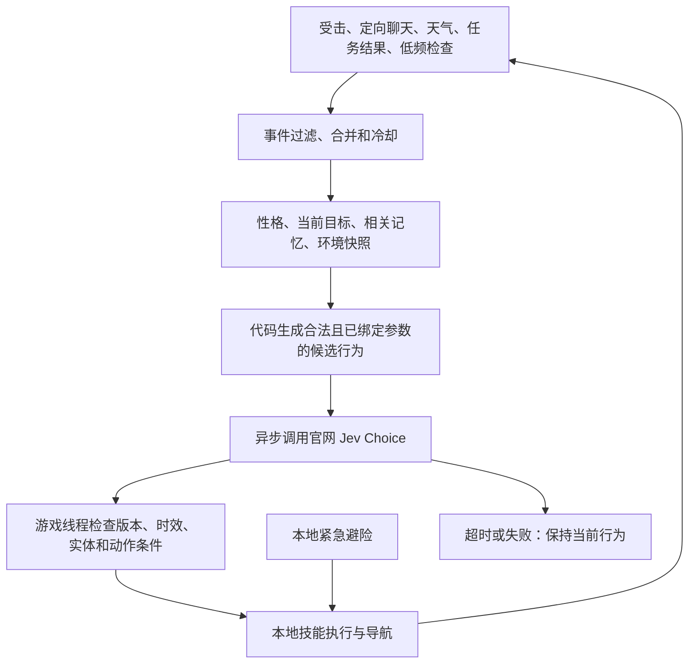

# Fabric 1.21.1 · 事件驱动的 Jev NPC 方案

更新：2026-09-22。基于本次讨论确定：先将 NPC 能力实现为可靠函数，再让 Jev 根据性格、环境、记忆、目标和触发事件选择行为。模型使用 TypeSafe 官网 HTTP 接口。背景资料见 [调研记录](research.md)，交付与验证状态见 [开发进度](development-progress.md)。

**目标是让模型做有限决策，游戏代码拥有执行过程。** 同一次“砍树”决策可以驱动几十至几百个游戏 tick；期间不需要每破坏一块方块都问模型。玩家可以用自然语言改变目标，任务完成、失败或环境发生重要变化后再判断。危险处置不能等待云端。

**行为接口应包含生命周期。** 每个行为有未开始、执行中、完成、失败或取消状态；可中断的工作可保存为暂停任务。行为内部处理路径、攻击节奏、物品消耗、坐标变化和进度。返回明确的结果，例如路径不可达、材料不足、目标消失、空间占用，决策层据此判断下一步。

| 行为 | 完整方案接口 | Demo 实现边界 |
| --- | --- | --- |
| 移动 | `moveTo(destination)` | 32 格内手动指定位置；模型从已有位置候选中选 |
| 跟随 | `follow(entity, distance)` | 跟随自己的主人并保持约 3 格距离 |
| 等待／守卫 | `wait()`、`guard(anchor, radius)` | 原地等待；守卫锚点附近并攻击敌对生物 |
| 攻击 | `attack(target, constraints)` | 仅选择当前可见的敌对生物；不攻击玩家 |
| 撤退 | `flee(destination)` | 本地选取远离敌人的位置，保留被打断任务 |
| 砍树 | `harvestTrees(area, quantity)` | 附近带树叶的原木，固定最多 4 块；不负责爬高和挖掘通路 |
| 挖掘 | `mine(area, blockType, quantity)` | 附近裸露石头／圆石，固定最多 4 块；按战利品表收集产物 |
| 建造 | `build(blueprint, origin, palette)` | 3×3 橡木平台；消耗 9 块随身木板，不覆盖现有实体方块 |
| 装备 | `equip(item, slot)` | 从背包装备铁胸甲；工作和战斗自动切换已有工具 |
| 进食 | `eat(item)` | 消耗一块面包，按 Demo 规则恢复 6 点生命 |
| 发言 | `speak(conversation, intent)` | Jev 选择打招呼、说明能力或求助；模板发言，不接第二个模型 |

这些能力不意味着能自由通关、自动造任意建筑或进行完整对话。后续可以添加蓝图生成、任务规划、更多物品与行为；现阶段优先证明闭环。

**候选项是一项已经绑定参数的动作。** 例如：继续当前工作；跟随主人；攻击指定 UUID 的僵尸；返回已记录的家；在主人发出请求位置的东侧搭 3×3 平台。Jev 只返回候选 ID，应用层取回原本的 ActionPlan，避免凭空生成坐标或把行为与无关目标组合。不能匹配时可说明支持能力或继续当前任务。

接口固定为 `POST https://api.typesafe.ai/v1/systemone`，Bearer 鉴权；请求含 `model`、`state`、`questions.next_action`。问题类型为 `choice`，候选说明放在 `criteria`。消费 `answers.next_action.choice`、`confidence`、返回模型版本和 `usage.input_tokens`。API key 不进入状态、日志、异常正文或 jar。HTTP 不跟随重定向。生产端点不能通过配置改到其他网站。[官网 HTTP 文档](https://docs.typesafe.ai/api)、[函数选择示例](https://docs.typesafe.ai/cookbooks/function_calling)

**事件有重要性与合并窗口。** 定向聊天只接受主人在附近发出的 `/jev ask …` 或 `@小杰 …` / `@jev …`，普通全服聊天不会扇出到所有 NPC。天气只在晴雨雷或昼夜状态切换时形成事件。受击合并为最新摘要；任务结束／失败形成后续事件；低频检查默认 30 秒一次，支持长期安静场景。

默认每 NPC 至少间隔 40 tick 才能提交下一次请求，事件合并窗口 8 tick；每 NPC 同时最多一个请求，全服务器默认最多 60 次／分钟。API 失败不立即重试；401/403 会延后，保留本地行为。配置值是 Demo 起点，不是效果保证。

**新事件不必终止旧任务。** `continue_current` 保留进度；聊天、装备和进食可以与工作共存。攻击／撤退可暂停一项原工作，再由 `resume_task` 恢复。初版只保留一级暂停任务，避免无界任务栈。玩家手动 `/jev do`、`/jev move` 和 `/jev stop` 进入手动控制；`/jev ask` 或 `/jev think` 恢复模型决策，便于比较纯代码和模型驱动行为。

**所有世界访问在服务器线程完成。** 发送前把状态序列化为 JSON；HTTP 只处理数据。结果用服务器 executor 回到游戏线程，再确认请求版本、结果年龄、实体仍存在、主人同维度且在范围内，以及执行时的目标／材料／空间条件。取消、新命令、实体卸载会使旧结果失效。世界没有因网络变慢而停顿的依赖。

**角色记忆与状态存在模组内。** 保存主人 UUID、性格、家的位置、背包、当前任务、一级暂停任务和最近 8 条相关事件。性格先提供 cautious（谨慎）、brave（勇敢）、diligent（勤勉）。血量、距离、库存由代码计算；模型读取短摘要。记忆来自游戏存档，不是模型在线训练。

**多人规则由服务器约束。** Demo 管理指令需要权限等级 2；主人身份决定谁能发指令或赠送物品。NPC 仅在主人在线、同维度且足够接近时工作。方块行为受配置、`mobGriefing`、主人建造能力和原生世界交互检查约束，不修改方块实体。第三方领地保护模组尚未接入，初版应在独立测试世界体验。天然树的识别采用附近树叶的启发式，不构成建筑识别保证。

**最小验收闭环**：召唤 NPC → 无 key 手动执行可靠技能 → 填 key 后理解中文请求 → 工作被危险打断 → 保留工作进度 → 恢复工作 → 保存并加载世界后仍能识别主人与恢复状态。

下一阶段按价值排序：真实中文语句评估与延迟记录；复杂地形恢复和树结构识别；明确数量／目标参数的解析；任务失败后的补给与规划；自由对话及可校验建筑蓝图；多人任务分配。先选定候选与执行能力，再扩大模型自由度。
