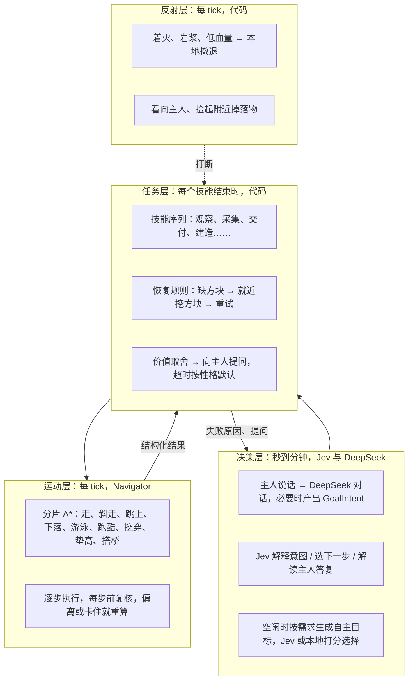

# 分层 Agent 设计：运动、恢复、发言、自主与对话

> 本文记录旧版设计。当前 `codex/jev-led-harness` 分工、调用边界及验收见 [Jev 主导 Harness](deepseek-harness-proposal.md) 与 [客户端验收](client-validation.md)。旧版 DeepSeek 直达任务、本地语义回退和关键词授权已被替换。

更新：2026-09-25。本文是 [design.md](design.md) 之后的下一阶段方案，当前决策结构见 [decision-architecture.md](decision-architecture.md)，交付状态见 [development-progress.md](development-progress.md)。

**感知与决策按时间尺度分层，模型只在代码无法或无权决定时被叫醒。** 从 A 走到 B 的过程里，跳、落、挖穿、垫高、搭桥、绕开岩浆都是 tick 级的「感知 → 行动」循环，由代码里的寻路规划器完成。模型面对的是少量目标级动作，以及代码整理好的、带选项的价值取舍。这样模型调用次数不随地形复杂度增长，暴露给模型的方法也不会膨胀。

## 运动层：Navigator

**对外只有一个动作：朝一个目标走。** 技能每 tick 调用 `navigator.tick(goal, policy, speed)`，得到「进行中 / 已到达 / 失败（带原因）」。目标变化不大时沿用原路径，变化超过 2 格才重算。搜索、执行、重算、卡住检测都在模块内部。

| 概念 | 内容 |
| --- | --- |
| `NavGoal` | `near(pos, r)` 到某点附近；`exact(pos)` 站到某格（如进入浅水）；`anyOf(spots)` 站到任一可工作位置 |
| `NavPolicy` | `mayBreak`、`mayPlace`、`maxFall`、`allowRisk`（在岩浆上方搭路或跳跃）、`mayBreakBuilt`（挖非天然方块） |
| `NavOutcome` | `Arrived`；`NeedBlocks(needed, carried)`；`NeedsPermission(kind, detail)`；`Unreachable(reason)` |

**移动类型。** 每个节点是一个可站立位置（脚下是实心方块，或脚在水里）。邻居由以下移动生成，每种有前置检查和代价：

- 平走、斜走（不切角）、跳上一格、下落（不超过 `maxFall`，落水可到 12 格）、水中上下游动。
- 跑酷：跨过 1 格宽的缺口，落点同高。
- 挖穿：挡住脚或头的方块可以挖掉，代价按工具真实破坏时间计算；挖下一格。
- 垫高：原地起跳，在脚下放一个方块。
- 搭桥：在前方脚下放一个方块再走过去。

**方块规则。** 默认只挖「天然地形」：泥土类、沙、沙砾、黏土、砂岩、主世界与下界基础石材、菌岩、雪、天然树叶和常见矿石。木板、玻璃、圆石、门等可能是玩家建筑，只有获得 `mayBreakBuilt` 才会挖。任何情况下都不挖：有方块实体的方块、不可破坏方块、紧挨岩浆的方块、上方压着沙或沙砾的方块、没有修改权限的位置。垫脚方块只用泥土、圆石、深板岩圆石、石头、安山岩、闪长岩、花岗岩、凝灰岩、下界岩；初始的橡木木板留给建造，不当垫脚。挖路时掉落物进入背包，所以挖穿本身会补充垫脚方块。

**危险。** 岩浆、火、仙人掌、岩浆块、浆果丛、细雪、蜘蛛网既不能站也不能穿过。靠近岩浆的节点加代价。把方块放进岩浆（在岩浆上搭桥）或跨越下方有岩浆的缺口属于「冒险」，需要 `allowRisk`。

**失败原因要能行动。** 真实搜索失败后，按顺序做反事实重算，第一个成功的就是原因：

1. 有移动因为方块不够被拒绝：假设方块无限再搜一次，路径用到几块就是缺口，返回 `NeedBlocks`。
2. 有移动因为冒险被拒绝：允许冒险再搜，成功则返回 `NeedsPermission("risk")`。
3. 有移动因为要挖非天然方块被拒绝：允许后再搜，成功则返回 `NeedsPermission("break_built")`，并附上要挖的数量。
4. 都不行：`Unreachable`，原因区分无路、区块未加载、卡住。

**性能边界。** 搜索在服务器线程上按 tick 分片，每 tick 默认最多展开 1500 个节点，一次搜索最多 6000 个。水平范围限制在起点 64 格内，只读已加载区块。预算用完仍未到达但已明显更近时，先走「部分路径」，到头后再搜。

## 任务层：恢复与升级

**代码能按规则解决的，直接解决。** 移动失败时先查恢复规则：`NeedBlocks(n)` 且允许挖掘时，暂停当前技能，就近挖 n+2 块天然地形方块（泥土或石头，产出泥土或圆石），然后恢复原技能并重新寻路。每个技能最多恢复 2 次，挖到的方块不计入主人任务的交付账本。恢复不挖任何人脚下的方块，也不挖下方悬空的方块，避免把自己站的平台挖穿。一块都挖不到时，原技能以原来的「需要 N 块」原因失败。

**涉及价值取舍的，交给主人。** `NeedsPermission` 在主人目标中出现时，NPC 在聊天框提问，任务进入「等待主人答复」，这期间不再调用模型。主人答应后，本任务获得对应授权（冒险或挖人造方块），重试失败的那一步；拒绝后把拒绝写进 `tool_results`，由 Jev 选择换目标或报告无法完成。超时（默认 60 秒）按性格处理：勇敢型对冒险默认同意，其他情况默认拒绝。自主目标遇到这类取舍直接放弃，不打扰主人。

## 发言出口

**所有发言走同一个出口。** `Communicator` 统一管理去重、限频和提问状态，分三类：

| 类别 | 发给谁 | 例子 | 规则 |
| --- | --- | --- | --- |
| 汇报 | 主人（系统消息 `[小杰]`） | 开始采集、任务完成、失败原因 | 相同内容 5 秒内只发一次 |
| 提问 | 主人（聊天样式 `<小杰>`） | 要不要冒险从岩浆上搭路过去？ | 同时只有一个问题；答复前任务暂停 |
| 观察 | 附近玩家（聊天样式 `<小杰>`） | 天快黑了、我受伤了、背包快满了、看到钻石矿 | 每个话题有冷却，所有观察之间至少间隔 10 秒 |

**答复不需要 @。** 有待答问题，或 NPC 最近 30 秒刚对主人说过话时，主人在 16 格内的普通聊天也会被当作回复。解读顺序：先本地关键词（先匹配否定词，避免「不可以」被当成「可以」）；关键词判断不了且配置了 Jev 时，用 Jev Choice 把原话映射到选项或「这是一条新指令」；都不行就当作新指令处理。

## 自主行为

**NPC 有自己的需求。** 代码根据状态计算需求强度（0 到 1），生成少量已绑定参数的自主候选：

| 需求 | 触发 | 候选 |
| --- | --- | --- |
| 安全 | 夜晚且离家远、血量低、附近有敌人 | 回家、进食、迎敌或撤退 |
| 陪伴 | 主人离开超过 16 格 | 跟随主人 |
| 垫脚储备 | 背包垫脚方块少于 16 块 | 就近挖 8 块天然地形方块 |
| 木材储备 | 原木少于 8 块且附近有树 | 采集 4 块原木 |
| 无聊 | 长时间空闲 | 在附近走动 |

没有主人目标、技能空闲时，默认每 10 秒评估一次。配置了 Jev 时，需求和候选进入状态，由 Jev 结合性格选择；没有 key 时按需求强度乘性格权重在本地选择，所以自主行为不依赖付费调用。主人一发指令就抢占自主工作。自主改动世界受额外限制：只挖天然地形和天然树木，只在家附近（默认 24 格）进行，可用 `autonomyMayModifyWorld=false` 关闭。

**空闲时的小动作不需要模型。** 反射层常驻：主人在 8 格内时看向主人；捡起 2 格内不是玩家扔出的掉落物。

## Jev 与 DeepSeek 的分工

**`GoalIntent` 是两者的交汇点。** Jev 的意图解释和 DeepSeek 的对话都能产出 `GoalIntent`，进入同一个任务层、走同一套校验。只有 `NpcBrain` 掌管身体，两个模型都不直接调用技能。

- **Jev（快、类型化、高频）：** 解释意图、选下一步工具、解读主人对提问的答复、在自主候选中选择。
- **DeepSeek（慢、自由文本、低频）：** 配置了 DeepSeek key 后，主人对 NPC 说的话先交给它。它返回 JSON：一句回复，以及可选的任务。任务带合法的 `intent` 时直接使用，省一次 Jev 调用；只有 `task_request` 时交给 Jev 解释。回复长度限制 200 字，去掉换行和格式代码；`intent` 的每个字段都按枚举校验，模型无法越过现有能力。对话上下文包含待授权问题、上个任务结果和最近八条实际发言，历史助手消息保持 JSON 格式。有效意图也优先使用任务复述，避免“好啊”丢失目标。调用失败时按原来的 Jev 指令流程处理；已有待授权问题则保留并提示重试。
- **只有 DeepSeek、没有 Jev key 时：** 意图已知的目标按固定顺序推进：能完成就结束，采够了就交付，有已观察到的目标就执行，否则先观察，最后报告做不到。攻击无法按语义区分目标，直接说明原因并结束，不会挑最近的任意生物。
- 接口固定为 `POST https://api.deepseek.com/chat/completions`，开启 JSON Output，关闭思考模式以降低延迟，默认模型 `deepseek-flash`。key 放在 `jev-npc.secret.json` 的 `deepseekApiKey`，环境变量 `DEEPSEEK_API_KEY` 优先。不跟随重定向，不记录请求和响应正文。

## 配置

新增字段都在 `jev-npc.json`，都有范围校验：

| 字段 | 默认 | 作用 |
| --- | --- | --- |
| `navAllowBreak`、`navAllowPlace` | true | 寻路时是否允许挖掘、放置（仍受 `allowBlockChanges` 和权限约束） |
| `navMaxFall` | 3 | 最大主动下落高度 |
| `navMaxNodes`、`navNodesPerTick` | 6000、1500 | 单次搜索与每 tick 的节点预算 |
| `questionTimeoutTicks` | 1200 | 提问等待时间 |
| `autonomyEnabled`、`autonomyIdleTicks` | true、200 | 自主行为开关与空闲评估间隔 |
| `autonomyMayModifyWorld`、`autonomyHomeRadius` | true、24 | 自主改动世界的开关与范围 |
| `llmEnabled`、`llmModel` | true、`deepseek-flash` | DeepSeek 对话开关与模型 |
| `llmTimeoutMs`、`llmMaxRequestsPerMinute` | 20000、20 | 对话超时与全服每分钟调用上限 |

## 落地顺序与验收

2026-09-25 在分支 `feat/layered-agent` 上按以下顺序全部实现，每一步单独提交；验收结果见 [development-progress.md](development-progress.md)。

1. **Navigator。** 纯 Java 规划器用网格世界做单元测试；GameTest 覆盖跳上台阶、挖出封闭空间、跨 1 格缺口、用携带方块搭桥、没有方块时报告缺口、绕开岩浆。`SkillRunner` 的移动、跟随、守卫、交付、建造、攻击追击、撤退、采集找站位全部改走 Navigator。
2. **恢复规则。** GameTest：没有垫脚方块时，移动任务先挖方块再搭桥到达；恢复挖到的方块不进入交付账本。
3. **发言出口与提问。** 单元测试覆盖去重、冷却、超时默认、否定词优先；GameTest 覆盖需要冒险时发问、答应后重试。
4. **自主目标。** 单元测试覆盖需求计算与性格权重；GameTest 覆盖无 key 时空闲 NPC 会自己补充垫脚方块、会捡起掉落物。
5. **DeepSeek。** 本地 HTTP 测试覆盖请求格式、JSON 解析、非法 `intent` 回退到 `task_request`、错误不泄露正文、缺 key 不发请求。

**本阶段不做：** 开门、梯子与藤蔓攀爬、潜行搭桥的视觉动作、下潜游泳、跨维度寻路、合成与熔炼、箱子存取、大模型规划长期目标。自主行为不会离开家附近，不会主动攻击非敌对生物。
