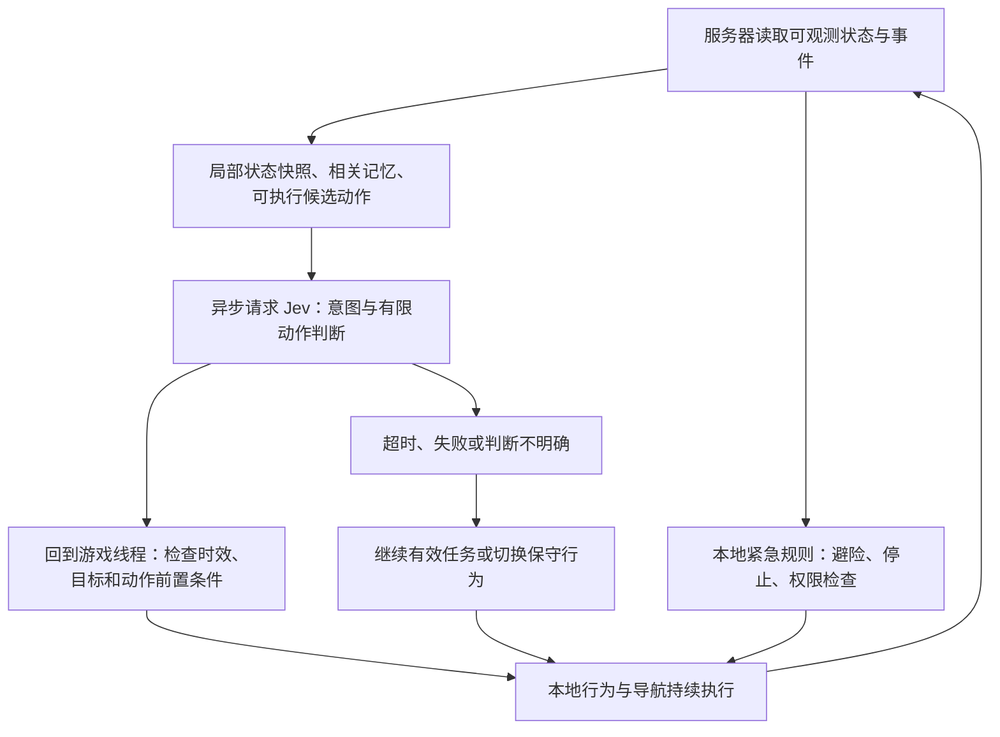

# TypeSafe / Jev 用于 Minecraft 智能生物与 NPC 的可行性调研

调研日期：2026-09-22。以 Java 版为主要设计对象；基岩版单独说明。本报告基于当前官方文档、官方演示和项目源码文档，尚未调用付费模型 API，也未运行 Minecraft 模组。文中的调用频率、成本场景、验收门槛和玩法设计均为工程建议或计算结果，不是实测性能。

**结论是可以做，最值得验证的是具有自然语言理解、持续目标和关系记忆的伙伴 NPC。** Jev 能在预先实现的行为之间做语义判断；游戏代码负责感知、寻路、动作、记忆和规则。这能形成比固定触发规则更灵活的生物行为，但装上分类模型并不会自动获得采矿、建造或长期生存能力。

这个方向已有相邻证据：TypeSafe 官方发布过基于结构化状态控制 Doom 的演示。它证明了这种决策接口可用于游戏控制；演示没有使用画面输入，也不能证明 Minecraft 中的效果或可靠性。官方同时承认传统 Doom bot 可以玩得更好，演示的价值在于适应状态表达和理解指令。[TypeSafe 发布说明](https://typesafe.ai/blog/introducing-system-one-models-and-jev)

**Jev 提供的是受约束的判断接口。** 当前三种原语可以直接映射到 NPC 决策：

| 原语 | 含义 | Minecraft 用法 |
| --- | --- | --- |
| Choice | 在候选项中选择一个，返回各项概率与置信度 | 在守卫、跟随、撤退、等待中选择下一项行为 |
| Noul | 判断某条件成立的概率 | 玩家这句话是否要求 NPC 停止追击 |
| Score | 按有具体描述的有序等级评价程度 | 根据交互记录评价玩家表达的敌意，用于社交反应 |

选择动作可用 Choice；多项条件可能同时成立时，分别使用 Noul。距离、血量阈值、物品数量和权限直接由代码判断，不值得请求模型。Noul 的 0.5 表示“是/否接近同等可能”，不能解释为“半生气”；Score 也不能代替精确算术。[System One](https://docs.typesafe.ai/concepts/system-one)、[Choice](https://docs.typesafe.ai/primitives/choice)、[Noul](https://docs.typesafe.ai/primitives/noul)、[Score](https://docs.typesafe.ai/primitives/score)

当前公开模型为 `jev-1.13.0`，输入是文本或文本化的 JSON，不接受截图、音频、视频。模组应直接读取游戏中的可观测状态，整理成紧凑 JSON。官方目前提供托管 API；本次查阅的公开资料未发现可下载权重或自托管方案，因此不能以 Jev 离线运行作为设计前提。[模型说明](https://docs.typesafe.ai/models)、[HTTP API](https://docs.typesafe.ai/api)

**能做出的玩法，取决于事先准备的行为能力。** 以下是设计建议，不是已完成的功能：

| 方向 | 玩家能感知到的变化 | 判断与工作量 |
| --- | --- | --- |
| 伙伴／护卫 NPC | 听懂“跟紧我”“别追远”“守在这里”，根据性格选择支援方式 | 最适合第一版：玩家互动明确，行为可限制在少量技能内 |
| 有关系记忆的村民 | 玩家曾救助、伤害或交易，会影响合作和接近意愿 | 可行；关系与事件必须持久化，不能只靠每次提示词 |
| 聪明的敌对生物 | 在已实现的进攻、绕路、呼叫同伴、撤离技能中选择 | 可行；即时战斗必须本地执行，简单战术通常规则就能完成 |
| 有性格的动物／宠物 | 区分安抚、驱赶、求助，对熟悉的人更愿意靠近 | 可行；适合测试语义与关系对行为的增益 |
| 工人／采集者 | 理解材料指令并执行收集、搬运、补给 | 可行但更费工程：工具、背包、可达性、方块破坏和任务恢复都要实现 |
| 整个自主村庄 | 多个 NPC 分工、履行约定、共享物资 | 后续方向；任务争抢、资源预留、调度和配额比单次分类更难 |
| 无限聊天、任意建造、从零通关 | 自由对话、创造复杂计划与新技能 | Jev 单独不足；需要生成式模型或规划系统，以及可执行的技能库 |

模型最可能有价值的部分，是理解玩家表达、处理关系背景、在带有角色偏好的合理行为中选择。已知距离触发攻击、天黑回家、血量低就逃跑，本来就能用普通代码高效完成。应通过对照测试证明语义判断改善了玩法，而不是仅增加模型调用。

**如果最终交付是一个新增生物模组，优先选 Java 原生实体路线。** Fabric 官方教程已经展示可寻路实体及 Goal 注册；NeoForge 也提供实体和寻路基础。模组可以用自己的决策器选择 Goal 或行为任务，不必重写底层移动。选定 Minecraft 版本后还要核实对应映射、依赖和整合包兼容性；不同版本的教程签名不能直接混用。[Fabric 实体教程](https://docs.fabricmc.net/develop/entities/first-entity)、[NeoForge 生物实体](https://docs.neoforged.net/docs/entities/livingentity/)

| 技术路线 | 适用场景 | 具体边界 |
| --- | --- | --- |
| Fabric／NeoForge Java 模组 | 新的生物、宠物、随从及自定义外观 | 最符合本次目标；首版只支持一个 loader，优先沿用目标整合包的选择；新增实体与渲染通常需要客户端组件 |
| Paper + Citizens | 给现有多人服增加商人、护卫或玩家外形 NPC | Citizens 提供 NPC、Traits、GoalController 和 Navigator；这是服务器插件路线。[API 仓库](https://github.com/CitizensDev/CitizensAPI) |
| Mineflayer + 寻路插件 | 快速验证能听指令、跟随和行动的队友 | 是通过协议加入服务器的 bot 玩家，不是新增生物；适合先验证模型价值，再移植判断层。[Mineflayer](https://github.com/PrismarineJS/mineflayer)、[寻路插件](https://github.com/PrismarineJS/mineflayer-pathfinder) |
| 基岩版附加包 + 专用服务器 | 必须面向基岩版玩家的服务器玩法 | 官方 HTTP 模块 `server-net` 仅用于 Dedicated Server，普通客户端及 Realms 不支持，且仍属预发布；不能直接承诺手机导入普通附加包即可联网使用。[Microsoft 文档](https://learn.microsoft.com/en-us/minecraft/creator/scriptapi/minecraft/server-net/minecraft-server-net) |

Java 模组可以直接通过 HTTP 接入 Jev，不强制增加 Python／Node 服务。Mineflayer 原型则可以复用其 JavaScript 生态。若采用 Folia，必须按区域／实体调度模型处理世界访问，不能套用单一全局主线程设计。[TypeSafe HTTP API](https://docs.typesafe.ai/api)、[Paper Folia 支持](https://docs.papermc.io/paper/dev/folia-support/)

现有项目也提供借鉴：[Mindcraft](https://github.com/mindcraft-bots/mindcraft) 已有模型与 Mineflayer 行动库结合的实现；[Voyager](https://voyager.minedojo.org/) 展示了课程、技能库与反馈改进的长程探索路线。它们支持“模型加可执行技能可以接入 Minecraft”的判断，不能证明 Jev 已具备同样能力，也不构成目标版本的兼容性保证。

**推荐采用三层控制，网络请求与游戏循环分开。**

第一层是每 tick 可执行的本地控制：碰撞、路径跟随、攻击冷却、落水处理、停止指令和即时危险。第二层是 Jev 提供的语义判断，初版可从事件触发加每两秒一次常规检查开始。第三层是可选的低频规划或对话模型，仅在复杂任务或自由对话时调用。首个原型可以不引入第三层。

Jev 官方声明端到端响应约 70–500 毫秒，其公开评测主要从美国西海岸发起。以 Minecraft 默认 20 TPS、每 tick 50 毫秒计算，这已经约为 1.4–10 个 tick；中国网络、排队和状态构建还可能影响体验。因此这些数字不构成目标服务器上的延迟保证，也不能把 HTTP 调用放进同步 tick 流程。[TypeSafe 速度说明](https://typesafe.ai/blog/introducing-system-one-models-and-jev)、[Paper 调度文档](https://docs.papermc.io/paper/dev/scheduler/)

建议把一次决策实现为以下流程：

1. 在拥有该世界／实体的线程读取状态，生成不可变快照。包含实体标识、指令版本、观测时间及最近相关事件；后台线程只消费快照。
2. 代码先剔除明显不能执行的动作，例如没有食物时不能吃、目标不在有效世界中时不能攻击。保留等待或继续当前任务等可用选项。
3. 异步发送请求。每个 NPC 最多保留一个有效的在途决策，合并重复事件，避免新旧请求排队。
4. 回到游戏线程应用结果前，重新核验 NPC 存活、维度、目标存在、指令版本、结果时效和动作前置条件。过时结果直接丢弃。
5. 本地技能持续执行到完成、失败或被明确中断。设置最短行为保持时间及切换条件，减少“跟随—守卫—跟随”的抖动；紧急避险可以立即打断。
6. API 超时、429 或断网时，继续仍然有效的本地行为或降级等待／避险。对过时的战术判断不无限重试。

**输入状态的质量比堆积上下文更重要。** 一个护卫 NPC 所需的信息可以是：当前任务、角色性格、玩家原话、几个附近实体、近期相关互动、可执行动作以及代码算出的危险等级。没有必要发送整个区块、全部背包历史和所有聊天记录。

例如玩家说：“你帮我守住门口，别追怪追太远。”程序可以提供门口锚点、预设守卫范围、授权玩家身份及当前候选技能。模型判断“这是守卫指令”和“禁止远距离追击”；代码建立持续守卫任务，并用确定的距离规则限制追击。模型无需计算坐标或每一步移动。

如果一条请求包含“先去取食物，再回来守门”，就增加有限的任务模板或任务队列。不要假设一个动作分类结果已经完成多步骤规划。任意数量、坐标和复杂建筑计划也需要独立解析、验证或规划。

同一份状态上的独立问题可以一起问，例如当前意图、在守卫意图下的追击限制、玩家是否明确要求结束旧任务。并行问题看不到彼此答案，因此需要写清分支前提，最后由代码仅消费相关分支；若候选集依赖上一问的结果，就需要下一阶段。官方 function calling cookbook 展示了把自然语言转为有限函数名和参数的组合方式。[函数调用示例](https://docs.typesafe.ai/cookbooks/function_calling)、[并行问题示例](https://docs.typesafe.ai/cookbooks/parallel_questions)

**“有记忆”应当由模组实现。** 保存玩家 UUID、已确认的互动事件、当前承诺、角色偏好和任务状态；需要时检索相关记录。将“玩家打过我”的事件事实与“他可能带有敌意”的模型判断分开。距离、事件时效、关系数值的变化幅度由代码计算。用这种方式可以形成持续性格与关系反馈；它属于应用记忆，不是模型在游戏中自动训练自己。

**置信度不能替代游戏规则。** Choice／Score 的置信度来自输出分布，不能理解为“执行一定正确”。多个合理动作并存时分布也可能分散。跟随还是等待这种偏好选择可以宽松处理；物品转移、攻击对象和方块修改必须经过代码中的权限与前置条件检查。不要把敌意分类当成服务器授权。模型已公开提示其会受对抗文本影响，聊天中“忽略规则”一类内容不能突破代码允许的动作边界。[置信度说明](https://docs.typesafe.ai/confidence)、[已知局限](https://docs.typesafe.ai/model-jaggedness/jev-1.13)

**成本适合少量活跃 NPC，大规模需要调度。** 官方当前价格是每百万输入 token 0.042 美元，输出免费；公开配额为每分钟 1,200 次请求和每秒 250,000 token，并注明配额会动态变化。[官方价格与限制](https://docs.typesafe.ai/models)

下面假设每个 NPC 每两秒独立发送一次请求，每次总输入 1,000 token，已经包含状态、问题和候选说明；所有 NPC 在统计时间内一直活跃：

| 活跃 NPC 数量 | 请求／分钟 | 请求／小时 | 输入费用／小时 | 每天 4 小时、30 天 |
| --- | ---: | ---: | ---: | ---: |
| 1 | 30 | 1,800 | $0.0756 | $9.07 |
| 10 | 300 | 18,000 | $0.7560 | $90.72 |
| 40 | 1,200 | 72,000 | $3.0240 | $362.88 |
| 100 | 3,000 | 180,000 | $7.5600 | $907.20 |

计算式：每小时费用 = 活跃 NPC 数 × 每秒调用次数 × 3,600 × 每次输入 token ÷ 1,000,000 × 0.042。该表不包含服务器、可选聊天模型、重试及服务商加价；1,000 token 是预算假设，不是本次测得的输入长度。

在“一 NPC 一请求”的假设下，40 个已经用完公开的每分钟请求额度，事件突发还需要额外余量；100 个超过额度，即使愿意付费也不能按这个频率持续运行。若总输入变为 3,000 token，表中输入费用再乘 3。若每秒调用 10 次，则比表中的调用频率和费用高 20 倍。

优化方向是：仅对玩家附近的活跃 NPC 启用语义决策；事件无变化时继续旧任务；休息状态降低频率；同一 NPC 的多项判断共享一次状态输入；对同一区域的少量 NPC 可研究小批量请求，但要测量状态变长后的准确率及延迟。远处或未加载的生物不应持续请求模型。大规模村庄还可以先做村庄级任务分配，再由居民本地完成任务，避免每个居民频繁重复做相同判断。

**上线前有三项特别值得实测。** 第一是中文：官方明确英文是主要训练语言，包含中文在内的其他语言表现不等同，需要用真实中文指令测试。第二是情境理解：官方披露数字、复杂间接关系和无关长上下文是弱项，状态组织应为这些限制做准备。第三是服务表现：目标服务器的 p50／p95／p99、429、超时和实际输入 token，不能由宣传数字推导。[语言支持](https://docs.typesafe.ai/models)、[模型局限](https://docs.typesafe.ai/model-jaggedness/jev-1.13)

建议初版固定经过测试的版本 `jev-1.13.0`，记录每次实际返回的版本、输入 token、延迟、决策和执行结果。模型升级后重新跑评估。API key 放在服务器配置或受控后端，不随公开客户端模组发布；单人游戏的本地配置可以使用玩家自己的 key。[模型版本说明](https://docs.typesafe.ai/models)、[API 鉴权](https://docs.typesafe.ai/api)

**首个验证范围建议是 1–3 个伙伴，最多扩至 10 个活跃 NPC。** 给每个 NPC 实现跟随、等待、守卫锚点、返回安全点、撤退、吃食物、拾取许可物品和攻击许可敌对目标这八种有限技能。某技能实现不稳定时先从候选集中移除。用固定角色设定与少量事件记忆形成个性，回复先用模板即可。

开发顺序建议是：先把同样八种技能用规则驱动跑通，形成对照基线；再把中文指令和语义行为选择接入 Jev；最后评估引入关系记忆是否使玩家感到行为更合理。采矿、任意建筑、动态写代码及村庄经济留待基础执行能力可靠后再评估。

| 验证问题 | 建议方法 | 判断依据 |
| --- | --- | --- |
| 中文理解是否够用 | 建立约 100–200 个独立测试场景，覆盖同义句、否定、取消、模糊指代与无匹配情况 | 分别统计意图与参数正确率，不能只统计分类命中率 |
| NPC 是否真正在执行 | 做守卫、跟随、撤退等任务回放 | 完成率、卡住时间、无意义切换次数，对比纯规则版本 |
| 是否跟得上游戏 | 从目标服务器测完整链路，区分事件触发和周期调度等待 | p50／p95／p99、过时结果比例；可先以交互决策 p95 不超过 1 秒为体验目标 |
| 网络失败时能否继续玩 | 人为注入 429、超时、断网、旧请求晚到 | tick 线程不等待网络，NPC 仍能本地避险，旧决策不覆盖新命令 |
| 游戏状态变化是否正确处理 | 目标死亡、切维度、区块卸载、重启、玩家撤销任务 | 不重复转移物品、不攻击失效目标、不恢复已取消任务 |
| 规模和费用是否受控 | 在固定环境下测试 1／3／10 个 NPC，并记录实际 token 和调用数 | 比较 tick 耗时、请求量与规则基线；满足设定的预算和配额余量 |

表中数量与体验目标都是拟议的验收设计，不是已经通过的测试。即使模型判断准确，路径寻找和技能失败仍可能让 NPC 显得笨；最终应以游戏行为和玩家体验评价。

推荐的立项边界是：一个 Java 版伙伴 NPC 模组，八项左右可靠技能、中文有限指令、可持久化关系与任务、异步 Jev 决策、本地故障回退。先用它验证语义判断是否比固定规则更有趣，再决定是否投入村庄模拟或更复杂的自主生存。具体工期需要确定 Minecraft 版本、已有行动库与美术要求后才能可靠估算。
